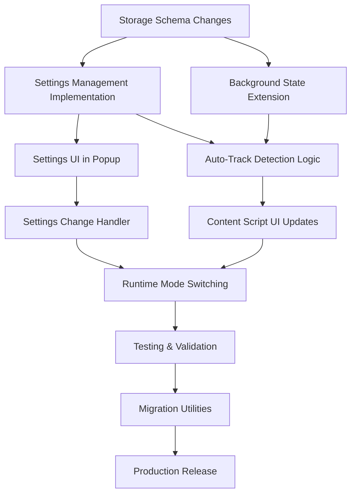

# Auto Bookmarks - Task Analysis & Implementation Order

## Task Dependencies

## Implementation Phases

### Phase 1: Foundation (Days 1-2)
1. **Storage Schema Changes**
   - Add `autoTrack` to settings schema
   - Update storage type definitions
   - Add schema version for migration
   - Dependencies: None

2. **Settings Management Implementation**
   - Create `AutoTrackSettings` interface
   - Implement `getAutoTrackSettings`/`setAutoTrackSettings`
   - Add storage utilities for settings
   - Dependencies: Storage Schema Changes

3. **Background State Extension**
   - Add `autoTrackEnabled` to background state
   - Implement state initialization
   - Add state update methods
   - Dependencies: Storage Schema Changes

### Phase 2: Core Logic (Days 2-3)
4. **Settings UI in Popup**
   - Create settings section component
   - Implement toggle switch
   - Add help text and styling
   - Dependencies: Settings Management Implementation

5. **Auto-Track Detection Logic**
   - Modify `handleVideoDetected`
   - Implement site support checking
   - Add automatic tracking logic
   - Dependencies: Background State Extension, Settings Management Implementation

6. **Content Script UI Updates**
   - Create auto-track UI components
   - Implement UI state management
   - Add tracking indicators
   - Dependencies: Auto-Track Detection Logic

### Phase 3: Integration (Days 3-4)
7. **Settings Change Handler**
   - Implement settings change detection
   - Add message passing for updates
   - Create settings sync logic
   - Dependencies: Settings UI in Popup

8. **Runtime Mode Switching**
   - Handle mode transitions
   - Implement state preservation
   - Add cleanup procedures
   - Dependencies: Settings Change Handler, Content Script UI Updates

### Phase 4: Quality Assurance (Days 4-5)
9. **Testing & Validation**
   - Write unit tests
   - Perform integration testing
   - Test edge cases
   - Manual verification
   - Dependencies: Runtime Mode Switching

10. **Migration Utilities**
    - Create migration helpers
    - Add version checking
    - Implement data conversion
    - Dependencies: Testing & Validation

11. **Production Release**
    - Final testing
    - Documentation updates
    - Version bump
    - Dependencies: Migration Utilities

## Critical Path
1. Storage Schema → Settings Management → Auto-Track Detection → Content Script UI → Runtime Mode Switching → Testing → Release
2. Storage Schema → Background State → Auto-Track Detection

## Risk Assessment

### Technical Risks
1. **Storage Migration**
   - Risk: Data loss during schema update
   - Mitigation: Backup before migration, rollback capability

2. **State Management**
   - Risk: Race conditions in mode switching
   - Mitigation: Careful state synchronization, thorough testing

3. **Performance Impact**
   - Risk: Increased storage usage
   - Mitigation: Implement cleanup strategies early

### Development Risks
1. **Timeline**
   - Risk: Complex UI interactions take longer than expected
   - Mitigation: Start UI work early, parallel development

2. **Testing Coverage**
   - Risk: Missing edge cases
   - Mitigation: Comprehensive test plan, beta testing

## Resource Requirements
- 1 developer
- 5 working days
- Chrome extension development environment
- Test YouTube accounts/content

## Success Criteria
1. Auto-tracking works reliably on YouTube
2. Settings persist correctly
3. UI provides clear feedback
4. No regression in manual tracking
5. Performance remains acceptable

## Monitoring & Metrics
1. **Usage Metrics**
   - Number of auto-tracked videos
   - Settings toggle frequency
   - Storage utilization

2. **Performance Metrics**
   - UI response time
   - Storage operation latency
   - Memory usage

## Rollout Strategy
1. **Phase 1: Internal Testing**
   - Developer testing
   - Basic functionality verification

2. **Phase 2: Beta Release**
   - Limited user testing
   - Gather feedback
   - Monitor metrics

3. **Phase 3: Full Release**
   - Gradual rollout
   - Monitor for issues
   - Gather user feedback 