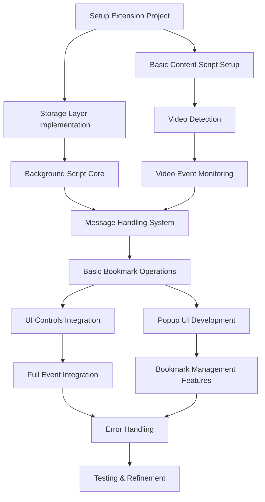

# Manual Bookmarks - Task Analysis & Implementation Order

## Task Dependencies

## Implementation Phases

### Phase 1: Foundation
1. **Setup Extension Project** (Day 1)
   - Initialize Chrome extension project
   - Setup build system (e.g., webpack)
   - Configure TypeScript
   - Create basic manifest.json
   - Dependencies: None

2. **Storage Layer Implementation** (Day 1-2)
   - Implement VideoBookmark interface
   - Setup chrome.storage.local wrapper
   - Create CRUD operations
   - Dependencies: Project Setup

3. **Basic Content Script Setup** (Day 1-2)
   - Create content script entry point
   - Setup basic YouTube page detection
   - Configure permissions
   - Dependencies: Project Setup

### Phase 2: Core Functionality
4. **Video Detection** (Day 2-3)
   - Implement MutationObserver
   - Create video element detection
   - Extract video metadata
   - Dependencies: Basic Content Script

5. **Background Script Core** (Day 2-3)
   - Setup background script
   - Implement core state management
   - Create storage interaction methods
   - Dependencies: Storage Layer

6. **Video Event Monitoring** (Day 3-4)
   - Implement timeupdate handler
   - Add seeking event handler
   - Create pause/play handlers
   - Setup ended event handling
   - Dependencies: Video Detection

### Phase 3: Integration
7. **Message Handling System** (Day 4)
   - Create message types
   - Implement content script messaging
   - Setup background script listeners
   - Dependencies: Background Script Core, Video Event Monitoring

8. **Basic Bookmark Operations** (Day 4-5)
   - Implement bookmark creation
   - Add bookmark updates
   - Create bookmark deletion
   - Setup bookmark queries
   - Dependencies: Message Handling System

### Phase 4: User Interface
9. **UI Controls Integration** (Day 5-6)
   - Create bookmark button
   - Add timestamp display
   - Implement status indicators
   - Dependencies: Basic Bookmark Operations

10. **Popup UI Development** (Day 5-6)
    - Create popup HTML structure
    - Implement bookmark list view
    - Add basic styling
    - Dependencies: Basic Bookmark Operations

### Phase 5: Enhancement
11. **Full Event Integration** (Day 6-7)
    - Implement periodic saves
    - Add tab close handling
    - Create auto-update system
    - Dependencies: UI Controls Integration

12. **Bookmark Management Features** (Day 6-7)
    - Add search functionality
    - Implement filtering
    - Create sorting options
    - Dependencies: Popup UI Development

### Phase 6: Polishing
13. **Error Handling** (Day 7-8)
    - Implement retry mechanisms
    - Add error notifications
    - Create recovery procedures
    - Dependencies: Full Event Integration, Bookmark Management

14. **Testing & Refinement** (Day 8-10)
    - Write unit tests
    - Perform integration testing
    - Manual testing
    - Bug fixes and optimization
    - Dependencies: Error Handling

## Resource Allocation

### Week 1 (Days 1-5)
- Focus on Phases 1-3
- Core functionality implementation
- Basic working prototype by end of week

### Week 2 (Days 6-10)
- Complete Phases 4-6
- UI polish and refinement
- Testing and bug fixes

## Critical Path
1. Project Setup → Storage Layer → Background Script → Message Handling → Basic Bookmark Operations
2. Project Setup → Content Script → Video Detection → Event Monitoring → Message Handling

## Risk Mitigation

### Technical Risks
1. **YouTube Player API Changes**
   - Regular testing against YouTube updates
   - Implement feature detection
   - Create fallback mechanisms

2. **Storage Limitations**
   - Implement data cleanup strategies
   - Add storage quota monitoring
   - Create data compression if needed

3. **Performance Issues**
   - Profile content script operations
   - Optimize event handling
   - Implement debouncing/throttling

### Development Risks
1. **Timeline Slippage**
   - Daily progress tracking
   - Prioritize core features
   - Maintain flexible scope for enhancement phase

2. **Testing Coverage**
   - Start testing early
   - Automate where possible
   - Regular manual testing sessions

## Success Criteria
1. Bookmarks can be created and persist across sessions
2. Video position is accurately tracked and restored
3. UI is responsive and intuitive
4. Error states are handled gracefully
5. Performance impact is minimal 